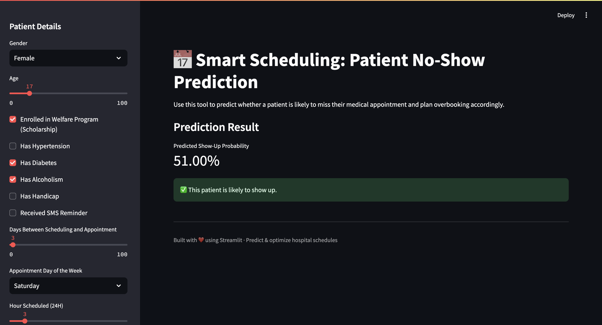
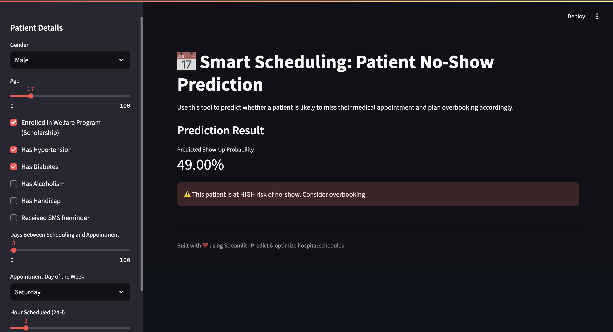

# Patient No-Show Predictor & Overbooking Optimizer

This project predicts whether a patient will show up for a scheduled medical appointment using historical data. It also simulates overbooking strategies to help hospitals optimize time slots and reduce operational inefficiencies.

---

## 📊 Problem Statement

Medical appointment no-shows lead to underutilized resources and financial losses. By predicting which patients are at high risk of not showing up, hospitals can implement overbooking strategies to fill potential gaps.

---

## 📁 Dataset

* **Source**: [Kaggle - Healthcare No-Shows Appointments Dataset](https://www.kaggle.com/datasets/iamtanmayshukla/healthcare-no-shows-appointments-dataset)
* **Records**: 106,987 appointments
* **Target Column**: `ShowedUp` (True if patient attended, False otherwise)

### ✅ Dataset Details

| Column                 | Description                                            |
| ---------------------- | ------------------------------------------------------ |
| `PatientId`            | Unique patient identifier                              |
| `AppointmentID`        | Unique appointment ID                                  |
| `Gender`               | Gender of the patient (M/F)                            |
| `ScheduledDay`         | Date when the appointment was scheduled                |
| `AppointmentDay`       | Actual date of the appointment                         |
| `DaysUntilAppointment` | Days between scheduled date and appointment date       |
| `Age`                  | Patient’s age                                          |
| `Neighbourhood`        | Area or hospital neighborhood                          |
| `Scholarship`          | Whether the patient is on welfare program (True/False) |
| `Hypertension`         | True if patient has hypertension                       |
| `Diabetes`             | True if diabetic                                       |
| `Alcoholism`           | True if patient is alcoholic                           |
| `Handicap`             | True if patient has any handicap                       |
| `SMS_received`         | True if SMS reminder was received                      |
| `ShowedUp`             | True if patient attended, False otherwise              |

### 💡 Features Engineered in This Project

| Feature                | Explanation                                 |
| ---------------------- | ------------------------------------------- |
| `DaysUntilAppointment` | `AppointmentDay - ScheduledDay` (in days)   |
| `ShowedUp`             | Boolean label indicating patient attendance |

---

## 🔧 Project Structure

```
├── data/
│   └── healthcare_noshows_appt.csv
├── notebooks/
│   ├── 02_eda_visualization.ipynb
│   ├── 03_modeling_prediction.ipynb
│   ├── 03_modeling_prediction_balanced.ipynb
│   └── 04_overbooking_simulation.ipynb
├── app/
│   ├── streamlit_app.py
│──Tag/v1.0
│   └── random_forest_noshow_model.pkl
├── requirements.txt
└── README.md
```

---

## 🔍 EDA Highlights

* Patients aged 0–20 are more likely to miss appointments.
* Long wait time between scheduling and appointment increases no-show likelihood.
* Receiving an SMS reminder does not strongly affect attendance.

---

## 🧠 Modeling

* **Models tried**:

  * Logistic Regression
  * Random Forest ✅ *(Best performance)*
  * XGBoost
* **Metrics used**:

  * Accuracy, F1-score, Recall, Confusion Matrix
* **Handling Imbalance**: Oversampling techniques applied in `03_modeling_prediction_balanced.ipynb`

---

## 🔎 Explainability

* SHAP used to interpret the Random Forest model.
* Key factors influencing predictions:

  * `DaysUntilAppointment`
  * `Age`
  * `Hypertension`, `Alcoholism`, `Diabetes`

---

## 📈 Overbooking Simulation

* Simulated doubling up appointments for high-risk no-show patients.
* Metrics observed:

  * Idle slots reduced
  * Crowd control maintained
* Strategy effective when applied with precision to top 10–15% risk group.

---

## 🌐 Streamlit App

Run locally:

```bash
streamlit run app/streamlit_app.py
```

Features:

* Upload test data (e.g., `preview_data.csv`)
* Predict no-show risk
* Simulate overbooking logic

---
## 📸 Demo Screenshot




> The app takes patient details like age, comorbidities, and scheduling gap, then predicts the likelihood of no-show. If the risk is high, it flags the patient for overbooking consideration.


## ☁️ Deploy to Streamlit Cloud

1. Push project to GitHub
2. Sign in to [Streamlit Cloud](https://streamlit.io/cloud)
3. Click `New app` > Connect to GitHub repo
4. Set file path to `app/streamlit_app.py`
5. Click `Deploy`

---

## 📦 Requirements

Install dependencies with:

```bash
pip install -r requirements.txt
```

---

## 🧠 Author & Contact

**Sandeep Undurthi**
M.S. in Computer Science @ Utah State University
Email: \[[sandy.undurthi@gmail.com](mailto:sandy.undurthi@gmail.com)]
GitHub: [https://github.com/sandeepundurthi](https://github.com/sandeepundurthi)

---

